# QR Scanner

A QR Scanning application which saves all scanned QR codes and let you copy result whenever you want.

## Tech Stack

- ***Framework***: Flutter

- ***Language***: Dart

- ***Database***: Firebase

## Features

Click to see features

 

- [x] Login/Signup
  - [x] Email validation
  - [x] Password should be between 6 to 15 character
- [x] Forgot Password feature
  - [x] You will recieve email for resetting password
  - [x] Link gets expire
- [x] Email verification
  - [x] Email verification link sends when you register
  - [x] At login time it checks if email is verified then it let login user
  - [x] Rate limit if user do many times
- [x] QR code scan
  - [x] Beep sound when QR gets scanned
  - [x] Vibration when QR gets scanned
  - [x] Flash light turn ON/OFF
  - [x] Check if the QR is previous scanned
- [x] QR data at homepage
  - [x] Saves scanned result into database
  - [x] Can copy scanned result by swiping right
  - [x] Can delete scanned result by swiping left
- [x] Profile feature
  - [x] Can set profile picture
  - [x] Supports photo from gallary
  - [x] Supports photo from direct camera
  - [x] Can set name
  - [x] Can set mobile number
  - [x] Can change password
- [x] Setting menu
  - [x] Can set if user wants beep sound at QR scan
  - [x] Can set if user wants vibration at QR scan
  - [x] Privacy policy
  - [x] Version information
- [x] Logout

## Screenshot

Click to see screenshots

 

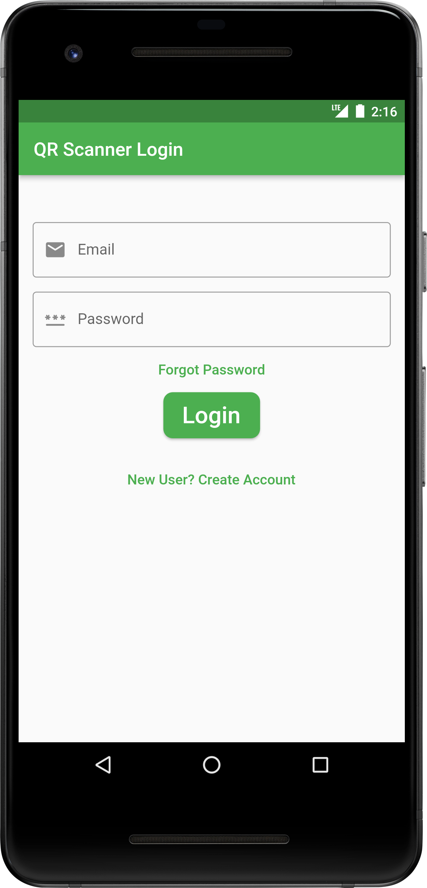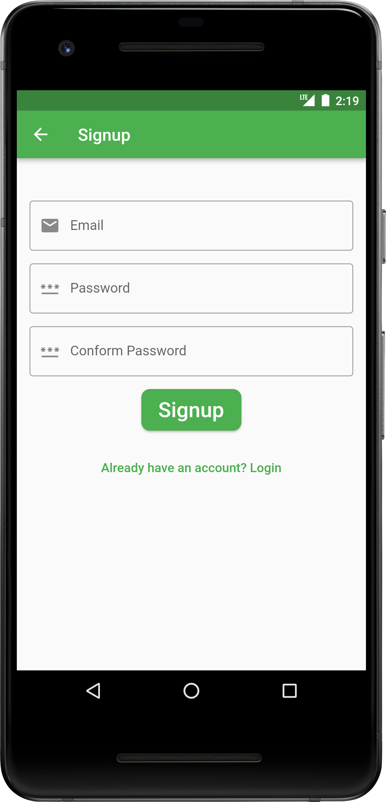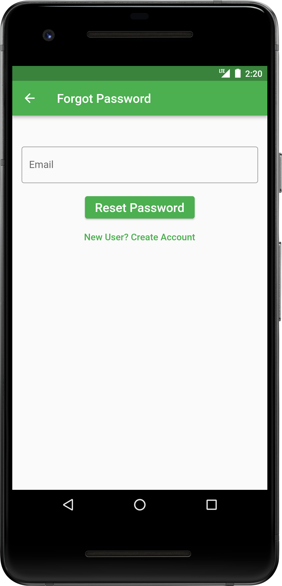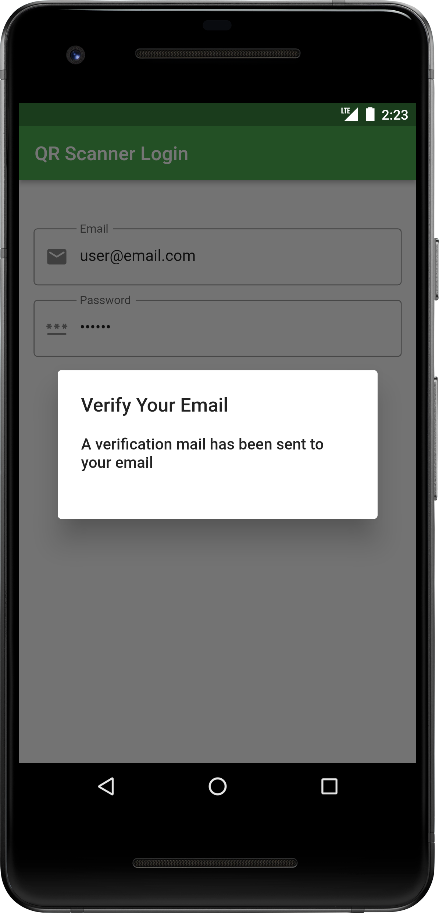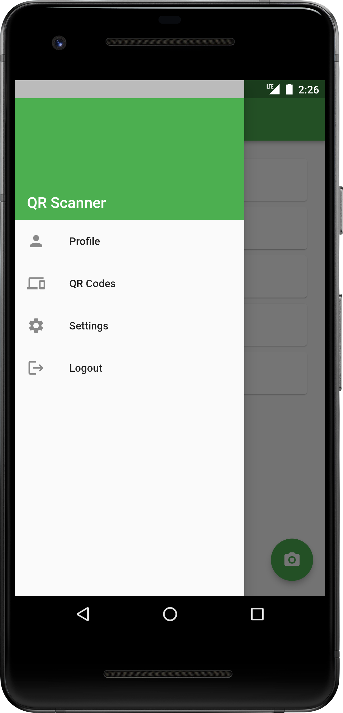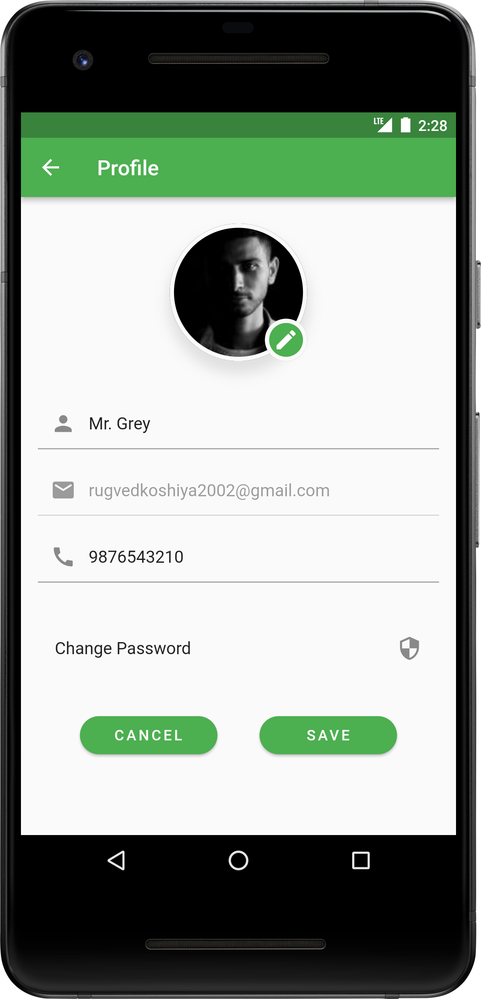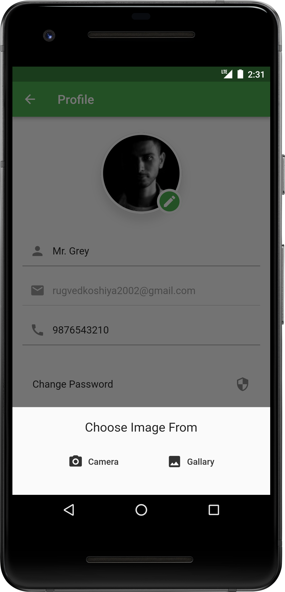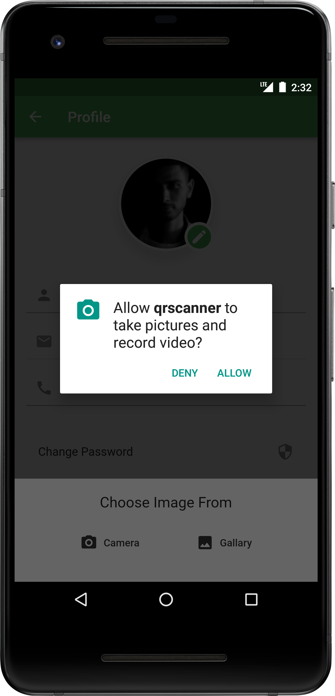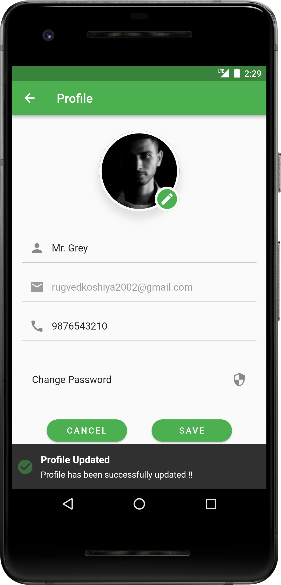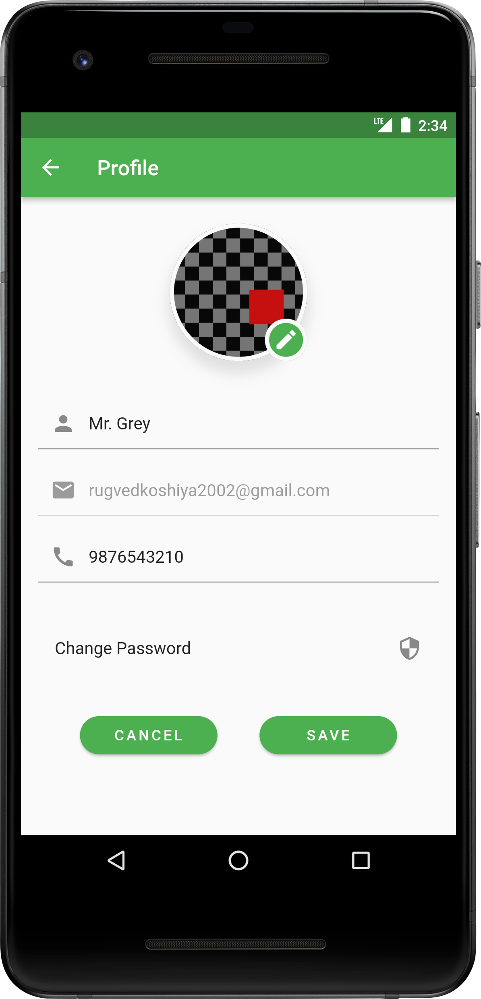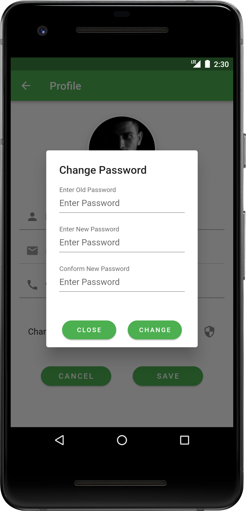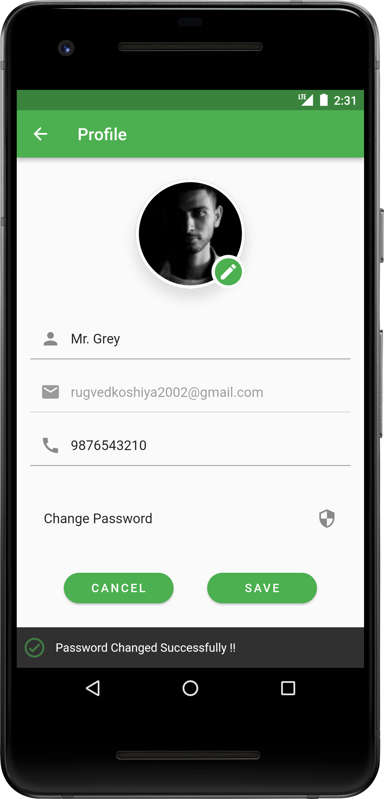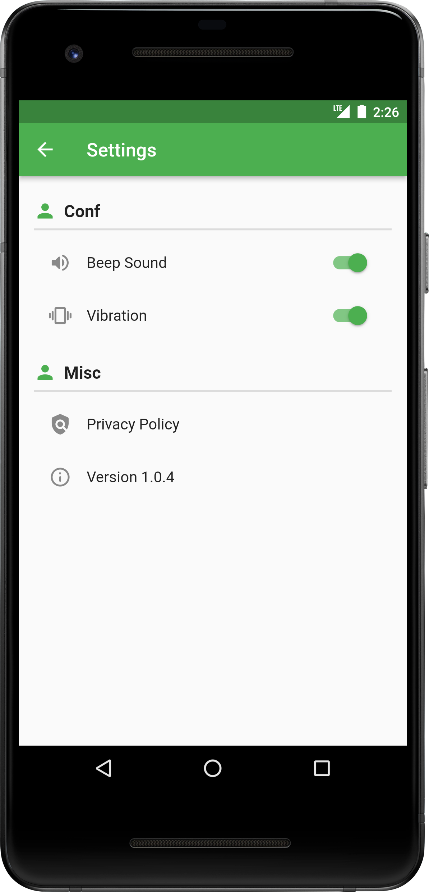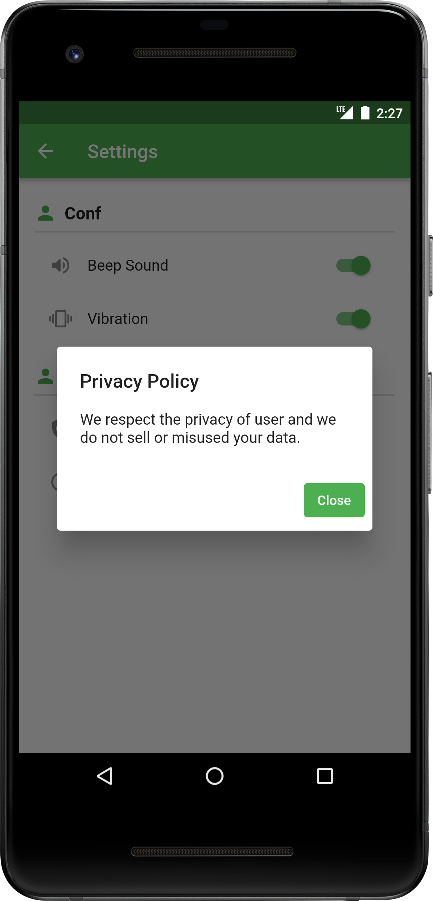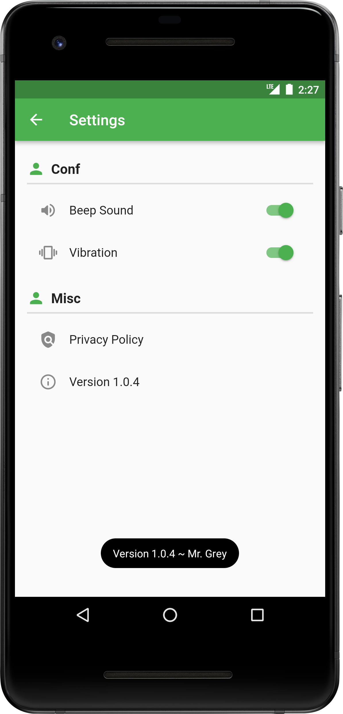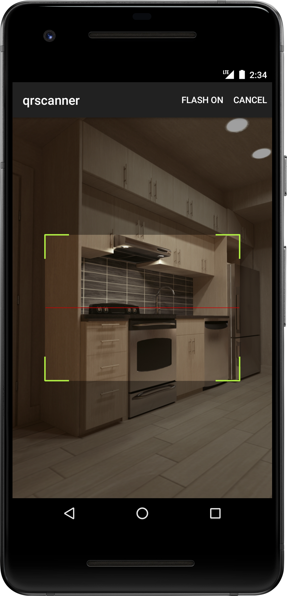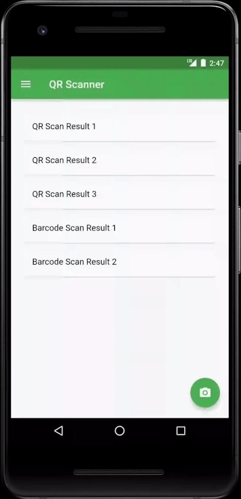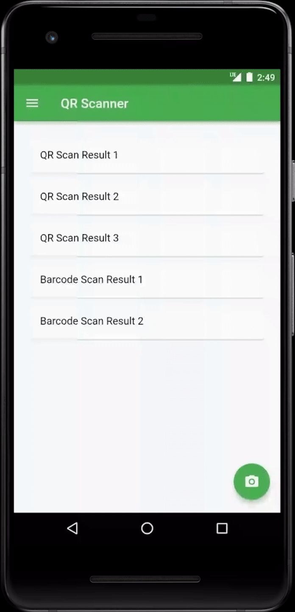

## Available on

## License

QR Scanner is distributed under the MIT Licence, See [Licence](LICENCE).